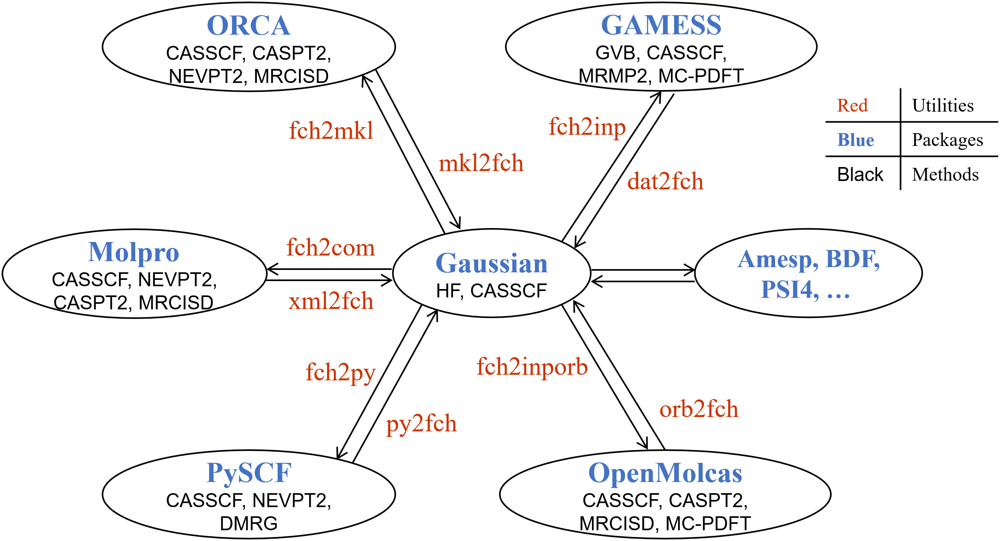

*中文版说明请点击[README_zh.md](README_zh.md)*  
*[Download the program](https://gitlab.com/jxzou/mokit/-/archive/master/mokit-master.zip)*
*&emsp;[GitHub mirror](https://github.com/1234zou/MOKIT)*
*&emsp;[NJU git mirror](https://git.nju.edu.cn/jxzou/mokit)*

# Molecular Orbital KIT (MOKIT)
MOKIT offers various utilities and modules to transfer MOs among various quantum
chemistry software packages. Besides, the automr program in MOKIT can set up and
run common multi-reference calculations in a block-box way.

A list of important utilities along with their functions are shown below  


With MOKIT, one can perform multi-reference calculations in a quite simple way,
and utilize the best modules of each program. E.g.

  UHF(UNO) -> CASSCF -> CASPT2  
  Gaussian&emsp;&emsp;PySCF&emsp;&emsp;OpenMolcas  
or  
  UHF(UNO) -> GVB   -> CASSCF -> NEVPT2  
  Gaussian&emsp;&emsp;GAMESS&emsp;&emsp;PySCF&emsp;&emsp;PySCF  
or   
  RHF      -> GVB   -> CASSCF -> ic-MRCISD+Q  
  Gaussian&emsp;&emsp;GAMESS&emsp;&emsp;PySCF&emsp;&emsp;OpenMolcas

Negligible energy loss(usually<1e-6 a.u., for the same wave function method in two
programs) are ensured during transferring MOs, since the basis order of angular
momentum up to H(i.e. l=5) are considered.

Pre-built `Windows* OS` executables of 20 utilities are provided in [Releases](
https://gitlab.com/jxzou/mokit/-/releases). Pre-built `Linux* OS` executables can
be downloaded in `Previous Artifacts` via the download button on the GitLab main
page.

Note that although MOKIT aims to make the multi-reference calculations block-box,
the users are still required to have practical experiences of quantum chemistry
computations (e.g. familiar with routine DFT calculations in Gaussian). You are
encouraged to learn how to use Gaussian if you are a fresh hand.

Dec 1, 2022

Installation
------------

### Option 1: Build from Source
* Prerequisites
    - Fortran compiler: `ifort`(>=2017) or `gfortran`(>=4.8.5)
    - Intel MKL(recommended) or [OpenBLAS](https://github.com/xianyi/OpenBLAS)
    - f2py (installing Anaconda Python3 recommended)

* Compile all modules
```
cd src
make all
```

* Compile individual utility or module  
  E.g.
```
make fch2inp
```

* After 'make all', you need to set environment variables `MOKIT_ROOT`, `PATH`
  and `PYTHONPATH`. E.g. if MOKIT is installed in `$HOME/software/mokit`, the
  following should be set in `~/.bashrc`:

```
export MOKIT_ROOT=$HOME/software/mokit
export PATH=$MOKIT_ROOT/bin:$PATH
export PYTHONPATH=$MOKIT_ROOT/lib:$PYTHONPATH
export GMS=$HOME/software/gamess/rungms
```

  Remember to modify the `GMS` path to suit your local environment. 

  Note that you
  need to run `source ~/.bashrc` or exit the terminal as well as re-login, in
  order to activate newly written environment variables.

* The original GAMESS code can only deal with GVB <=12 pairs. But nowadays we
  can do hundreds of pairs. To go beyond 12 pairs, please read Section 4.4.10
  in [manual](doc/).

### Option 2: Use Pre-compiled MOKIT
* Prerequisites: 
    - Although you don't need to have a Fortran compiler, `libgfortran.so` is still needed.
    - Still, you need to have a Python3 environment and NumPy.
* A detailed guide for choosing the version of pre-built artifacts and resolving dependencies can be found at [here](https://jeanwsr.gitlab.io/mokit-doc-mdbook/chap2-2.html)
* After downloading the pre-built artifacts, you still need to set all the environment variables mentioned above, and one more:

```
export LD_LIBRARY_PATH=$MOKIT_ROOT/lib:$LD_LIBRARY_PATH
```
  since the OpenBLAS dynamic library is put in `$MOKIT_ROOT/lib`. 

  There may still be some compatilibity problem when using pre-built MOKIT, so that's less recommended than building from source. Feel free to open an issue for any problems about that.

Quick Start
-----------
* Each utility is self-explanatory. For example, run `fch2inp` in Shell,
  you will find

   ERROR in subroutine fch2inp: wrong command line arguments!  
   Example 1 (R(O)HF, UHF, CAS): fch2inp a.fch  
   Example 2 (GVB)             : fch2inp a.fch -gvb [npair]  
   Example 3 (ROGVB)           : fch2inp a.fch -gvb [npair] -open [nopen]

* For usages of modules in lib/, see [examples/utilities/readme.txt](examples/utilities/readme.txt)

* The input syntax of the automr program is like Gaussian gjf. For example, the input
  file '00-h2o_cc-pVDZ_1.5.gjf' of the water molecule at d(O-H) = 1.5 A is shown below
```
%mem=4GB
%nprocshared=4
#p CASSCF/cc-pVDZ

mokit{}

0 1
O      -0.23497692    0.90193619   -0.068688
H       1.26502308    0.90193619   -0.068688
H      -0.73568721    2.31589843   -0.068688
```

  Run
```
automr 00-h2o_cc-pVDZ_1.5.gjf >& 00-h2o_cc-pVDZ_1.5.out
```

  in Shell. The automr program will successively perform HF, GVB, and CASSCF
  computations. See [examples/](examples/) for more examples.

QC Packages can be called by `automr`
----------
* [Gaussian](http://gaussian.com/)
* [PySCF](https://github.com/pyscf/pyscf)
* [GAMESS](https://www.msg.chem.iastate.edu/gamess/index.html)
* [OpenMolcas](https://gitlab.com/Molcas/OpenMolcas)
* [Molpro](https://www.molpro.net/)
* [ORCA](https://orcaforum.kofo.mpg.de)
* [BDF](http://182.92.69.169:7226/Introduction)
* [PSI4](https://github.com/psi4/psi4/)
* [Dalton](https://gitlab.com/dalton/dalton)
* [Q-Chem](https://www.q-chem.com/)

Some Tips
---------
* To avoid unnecessary errors, you must specify keywords 'nosymm int=nobasistransform'
  in Gaussian .gjf file, if you want to provide a .fch(k) file to `automr`.

Bug Report
----------
* If you find any bug frequently occurs, please contact the author jxzou via njumath[at]sina.cn,
  with your .fch(k) file and output files attached. The author may not answer or update code
  frequently since he is being postponed due to his PhD program.

* You can also open an issue on the [Issues](https://gitlab.com/jxzou/mokit/-/issues) page.

TODO
----
* MOs trasferring among BAGEL, CFOUR, NWCHEM, etc.

* Develop/Implement black-box strategies of excited state calculations

* Distribute pre-built via conda

Citation
--------
* If you use MOKIT in your work, please cite the gitlab page of MOKIT as

   Jingxiang Zou, Molecular Orbital Kit (MOKIT), https://gitlab.com/jxzou/mokit (accessed month day, year)

* If you use MOKIT to peform calculations involving GVB, citing the following
  two papers would be appreciated

   DOI: 10.1021/acs.jctc.8b00854; DOI: 10.1021/acs.jpca.0c05216.

* If you use MOKIT in your work, you should cite MOKIT in the main body of your
  paper. Citing MOKIT only in Supporting Information of your paper is insufficient.

* Please read the [manual](doc/) for details of citation. Your proper citation
  would be a great encouragement to developer.

Disclaimer
----------
Copyright (c) 2022 jxzou

All rights reserved.

Redistribution and use in source and binary forms are permitted provided that the above copyright notice and this paragraph are duplicated in all such forms and that any documentation, advertising materials, and other materials related to such distribution and use acknowledge that the software was developed by the author. The name of the authors may not be used to endorse or promote products derived from this software without specific prior written permission.

THIS SOFTWARE IS PROVIDED ``AS IS'' AND WITHOUT ANY EXPRESS OR IMPLIED WARRANTIES, INCLUDING, WITHOUT LIMITATION, THE IMPLIED WARRANTIES OF MERCHANTABILITY AND FITNESS FOR A PARTICULAR PURPOSE.

