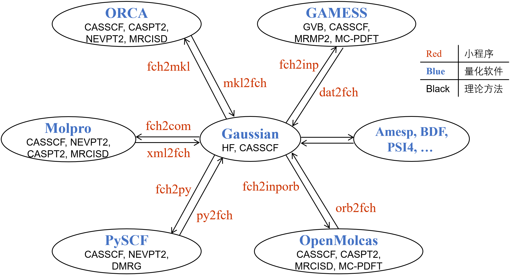

*[English](README.md)*
*&emsp;&emsp;[下载程序](https://gitlab.com/jxzou/mokit/-/archive/master/mokit-master.zip)*
*&emsp;&emsp;[GitLab仓库](https://gitlab.com/jxzou/MOKIT)*
*&emsp;&emsp;[GitHub镜像](https://github.com/1234zou/MOKIT)*
*&emsp;&emsp;[NJU-Git镜像](https://git.nju.edu.cn/jxzou/mokit)*
*&emsp;&emsp;[在线文档](https://jeanwsr.gitlab.io/mokit-doc-mdbook/)*

# Molecular Orbital KIT (MOKIT)
MOKIT提供各种小程序和模块，用以实现在常见量子化学软件间传递分子轨道。除此之外，MOKIT中的`automr`程序可以进行多参考（态）方法的自动化、黑箱式计算。

MOKIT中重要的小程序及其功能请见下图  


利用MOKIT中的automr程序（结合上图中的各个小程序），您可以十分简单地（即像DFT计算一样）进行多参考计算，并可充分利用每个量子化学软件最强的功能。例如，如下组合

  UHF(UNO) -> CASSCF -> CASPT2  
  Gaussian&emsp;&emsp;PySCF&emsp;&emsp;OpenMolcas  
or  
  UHF(UNO) -> GVB   -> CASSCF -> NEVPT2  
  Gaussian&emsp;&emsp;GAMESS&emsp;&emsp;PySCF&emsp;&emsp;PySCF  
or   
  RHF      -> GVB   -> CASSCF -> ic-MRCISD+Q  
  Gaussian&emsp;GAMESS&emsp;PySCF&emsp;OpenMolcas

整个过程都是自动的。MOKIT在不同量化程序间传轨道时，考虑了基函数角动量的顺序问题（最高支持H角动量，相当于C原子用cc-pV5Z基组，Zn原子用cc-pVQZ基组），因此同一种理论方法（例如CASSCF）在不同量化程序中的电子能量可以很好地复现（误差通常小于10^-6 a.u.），且几乎1-2圈收敛。

请注意，尽管MOKIT程序的目标是使多参考计算实现自动化和黑箱式，无需人为干预。但用户仍需具备使用常见量子化学软件的基本技能（例如熟悉Gaussian软件的常规DFT计算）。若您是一名量化新手，强烈建议先学习并熟练使用Gaussian软件做常规计算，否则很可能难以正确理解MOKIT的输出内容，或做出错误解读。

2024年10月31号

依赖
----------
每个可执行文件或模块依赖于量子化学程序的情况不同。以下列出了最常用可执行文件`automr`，`frag_guess_wfn`和Python模块`py2xxx`的最少依赖：
1. `automr`: GAMESS, PySCF
2. `frag_guess_wfn`: Gaussian
3. 绝大多数传轨道的小程序没有依赖，除了`py2gau`, `py2orca`, `py2molpro`这些Python模块需要在安装有PySCF时才能正常使用

注意官方GAMESS程序只能处理少于13对的GVB计算，但借助MOKIT现今可以实现上百对的GVB计算。因此请阅读[手册 4.4.10部分](https://jeanwsr.gitlab.io/mokit-doc-mdbook/chap4-4.html#4410-gvb_prog)使用提供的脚本自动修改GAMESS代码。

安装
----------
在Linux或MacOS上，您可以从以下展示的4种安装方式中选择一种来安装MOKIT，这些安装方式可以让您使用MOKIT全部功能。若您仅想使用小程序`frag_guess_wfn`，还有更简洁的安装方式，见[此处](https://jeanwsr.gitlab.io/mokit-doc-mdbook/chap2-2.html#223-only-want-frag_guess_wfn)。
开发者还提供`Windows系统`下预编译好的小程序，点击[下载](https://gitlab.com/jxzou/mokit/-/releases)。但请注意这些小程序的版本会滞后于master主分支代码，且无法在Windows上使用MOKIT的全部功能。

### 方式1：conda 联网安装（适用于Linux）

这是最简单的安装方法，但需要联网以自动下载依赖（例如Intel MKL）。强烈建议在安装前创建一个新环境，以免破坏 base 环境。
```
conda create -n mokit-py39 python=3.9 # 3.8~3.11 are available
conda activate mokit-py39
conda install mokit -c mokit
```

使用MOKIT时仍需保持`mokit-py39`环境处于激活状态。若您想通过conda-forge渠道安装MOKIT请阅读[此处](https://jeanwsr.gitlab.io/mokit-doc-mdbook/chap2-2.html#use-mokit-with-conda-forge-channel)。如果无法联网，但仍不想手动编译，请尝试方式3。

### 方式2：homebrew 联网安装（仅针对MacOS）
* 前提
    - 需要安装[homebrew](https://brew.sh)，更多帮助[见此处](https://jeanwsr.gitlab.io/mokit-doc-mdbook/chap2-2.html#optional-2-use-homebrew-toolchains-for-macos-only)。
    - 需要通过brew安装miniconda，并在base环境中通过pip安装numpy，如下
    
```
brew install --cask miniconda
conda init bash #(or zsh ) 
conda activate base
pip install numpy
```

接着
`brew install ansatzx/homebrew-mokit/mokit`

或者 `brew tap ansatzx/homebrew-mokit` 并且 `brew install mokit`.

最终按照caveats的提示, 在你的shell配置文件里添加如下环境变量
```zsh
export MOKIT_ROOT="$(brew --prefix)/Cellar/mokit/master"
export PATH=$MOKIT_ROOT/bin:$PATH
export PYTHONPATH=$MOKIT_ROOT:$PYTHONPATH
export LD_LIBRARY_PATH=$MOKIT_ROOT/mokit/lib:$LD_LIBRARY_PATH
```

### 方式3：使用预编译版

`Linux`预编译版本可从[此处](https://jeanwsr.gitlab.io/mokit-doc-mdbook/chap2-2.html#222-pre-built-linux-executables-and-libraries)下载。

* 前提: 需要有Python3环境和NumPy
* 如不清楚如何选择预编译版本或解决预编译版本的依赖问题，请阅读[此处](https://jeanwsr.gitlab.io/mokit-doc-mdbook/chap2-2.html#222-pre-built-linux-executables-and-libraries)。
* 下载预编译版后, 您需要在`~/.bashrc`文件中设定下述环境变量（假设MOKIT放在`$HOME/software/mokit`）：

```bash
export MOKIT_ROOT=$HOME/software/mokit
export PATH=$MOKIT_ROOT/bin:$PATH
export PYTHONPATH=$MOKIT_ROOT:$PYTHONPATH
export LD_LIBRARY_PATH=$MOKIT_ROOT/mokit/lib:$LD_LIBRARY_PATH
export GMS=$HOME/software/gamess/rungms
```
此处需要设置`LD_LIBRARY_PATH`是由于OpenBLAS动态库放在那里。GAMESS主程序路径`GMS`请按照您机器上的实际情况修改。注意：自MOKIT-v1.2.5rc2以后，`PYTHONPATH` 发生了变化。修改后需退出重登，以使环境变量生效。

### 方式4：从源码编译
MOKIT最新源代码可从[此处](https://jeanwsr.gitlab.io/mokit-doc-mdbook/chap2-3.html)下载。

* 前提（编译器和库要求）
    - Fortran编译器: `ifort`(>=2017) 或 `gfortran`(>=4.8.5)
    - Intel MKL(推荐安装Intel编译器，内含ifort和MKL) 或 [OpenBLAS](https://github.com/xianyi/OpenBLAS)
    - f2py (推荐安装Anaconda Python3，内含f2py)

* 编译全部模块， 执行
```
cd src
make all
```

* 在执行`make all`之后, 你需要设置三个环境变量`MOKIT_ROOT`, `PATH` 和 `PYTHONPATH`。例如，假定您MOKIT放在`$HOME/software/mokit`目录，您需要在`~/.bashrc`文件中设定以下环境变量:
```
export MOKIT_ROOT=$HOME/software/mokit
export PATH=$MOKIT_ROOT/bin:$PATH
export PYTHONPATH=$MOKIT_ROOT:$PYTHONPATH
export GMS=$HOME/software/gamess/rungms
```

GAMESS可执行文件的路径请按照您机器上的实际情况修改。注意：自MOKIT-v1.2.5rc2以后，`PYTHONPATH` 发生了变化。修改后需退出重登，以使环境变量生效。

快速开始
----------
* 每个小程序的使用十分简单，直接运行即可在屏幕上打印出使用说明。例如在Shell中运行小程序`fch2inp`，输出如下
```
 ERROR in subroutine fch2inp: wrong command line arguments!  
 Example 1 (R(O)HF, UHF, CAS): fch2inp a.fch  
 Example 2 (GVB)             : fch2inp a.fch -gvb [npair]  
 Example 3 (ROGVB)           : fch2inp a.fch -gvb [npair] -open [nopen]
```
您可在此[网页](https://jeanwsr.gitlab.io/mokit-doc-mdbook/chap4-5.html)上搜索需要的小程序及阅读相应文档.

* 对于mokit/lib/目录下Python动态库文件的使用方法，请阅读examples/utilities/目录下的[readme.txt](examples/utilities/readme.txt)

* 自动做多参考计算的核心程序automr的输入文件采用的是Gaussian gjf文件的格式。例如，一个O-H键长为1.5 A的水分子输入文件`00-h2o_cc-pVDZ_1.5.gjf`示例如下
```
%mem=4GB
%nprocshared=4
#p CASSCF/cc-pVDZ

mokit{}

0 1
O      -0.23497692    0.90193619   -0.068688
H       1.26502308    0.90193619   -0.068688
H      -0.73568721    2.31589843   -0.068688
```

只需在Shell中执行
```
automr 00-h2o_cc-pVDZ_1.5.gjf >& 00-h2o_cc-pVDZ_1.5.out
```

命令，`automr`程序会相继执行HF，GVB和CASSCF等计算,自动确定活性空间为CAS(4,4)。更多例子请见[examples](examples/)。

支持调用的量子化学程序
----------
* [Gaussian](http://gaussian.com)
* [PySCF](https://github.com/pyscf/pyscf)
* [GAMESS](https://www.msg.chem.iastate.edu/gamess/index.html)
* [OpenMolcas](https://gitlab.com/Molcas/OpenMolcas)
* [Molpro](https://www.molpro.net)
* [ORCA](https://orcaforum.kofo.mpg.de)
* [BDF](http://182.92.69.169:7226/Introduction)
* [PSI4](https://github.com/psi4/psi4)
* [Dalton](https://gitlab.com/dalton/dalton)
* [Q-Chem](https://www.q-chem.com)

温馨提示
----------
* 若您想提供.fch(k)文件给`automr`程序读入，请在计算前在Gaussian的输入文件中加上关键词`nosymm int=nobasistransform`，以避免后续产生不必要的、不可预见的错误。

汇报Bug
----------
* 若您发现MOKIT的程序错误或bug，或有任何使用建议，可在此页面[Issues](https://gitlab.com/jxzou/mokit/-/issues)上新建一个问题。

* 您也可以通过电子邮件njumath[at]sina.cn联系开发者jxzou。在邮件中请将您的相关文件（例如.gjf, .fch, .out文件等）打包、压缩并添加为附件发送。

* 还可加入MOKIT用户交流QQ群，群号：470745084

下一步计划
----------
* 支持NWCHEM, BAGEL, COLUMBUS等软件间传轨道

* 开发和实现稳健的多参考激发态自动计算策略

如何引用
----------
* 当前MOKIT未发表专门的论文，若您在您的研究中使用了MOKIT的任何一个子程序，请按如下引用

   Jingxiang Zou, Molecular Orbital Kit (MOKIT), https://gitlab.com/jxzou/mokit (accessed month day, year)

* 若您使用MOKIT进行了GVB方法的相关计算，建议您也引用以下2篇文献

   DOI: [10.1021/acs.jctc.8b00854](https://www.doi.org/10.1021/acs.jctc.8b00854); DOI: [10.1021/acs.jpca.0c05216](https://www.doi.org/10.1021/acs.jpca.0c05216).

* 若您在您的研究中使用了MOKIT的任何一个子程序或模块，请在正文参考文献中恰当引用MOKIT，仅在补充材料中引用MOKIT是不够的。EndNote引用文件请见[此处](https://gitlab.com/jxzou/mokit/-/tree/master/doc?ref_type=heads)。更详细的引用说明和示例请见[手册](https://jeanwsr.gitlab.io/mokit-doc-mdbook/chap1-2.html)，您的规范引用是对开发者的极大鼓励。您可以使用MOKIT为其他人做计算（包括代算），但务必提醒他/她在发表文章时恰当地引用MOKIT和计算中用到的量子化学软件。

* 点击[这里](https://jeanwsr.gitlab.io/mokit-doc-mdbook/citing.html)可以浏览引用MOKIT的已发表文章。

